# 1st Cloud Assignments Task

Your login name: altschool i.e., home directory /home/altschool. The home directory contains the following sub-directories: code, tests, personal, misc Unless otherwise specified, you are running commands from the home directory.

**Questions**

1. Change directory to the tests directory using absolute pathname

1. Change directory to the tests directory using relative pathname

1. Use echo command to create a file named fileA with text content ‘Hello A’ in the misc directory

1. Create an empty file named fileB in the misc directory. Populate the file with a dummy content afterwards

1. Copy contents of fileA into fileC

1. Move contents of fileB into fileD

1. Create a tar archive called misc.tar for the contents of misc directory

1. Compress the tar archive to create a misc.tar.gz file

1. Create a user and force the user to change his/her password upon login

1. Lock a users password

1. Create a user with no login shell

1. Disable password based authentication for ssh

1. Disable root login for ssh

**Answers:**

**Your login name: altschool i.e., home directory /home/altschool.**
**The home directory contains the following sub-directories: code, tests, personal, misc Unless otherwise specified**

```
vagrant@ubuntu-3nity:~$ sudo useradd -m -s /usr/bin/bash Altschool
vagrant@ubuntu-3nity:~$ sudo passwd Altschool
vagrant@ubuntu-3nity:~$ sudo usermod -aG sudo altschool
vagrant@ubuntu-3nity:~$ getent passwd | grep Altschool
vagrant@ubuntu-3nity:~$ getent group | grep Altschool
vagrant@ubuntu-3nity:~$ su Altschool
Altschool@ubuntu-3nity:~$ pwd
Altschool@ubuntu-3nity:~$ mkdir code tests personal misc
```
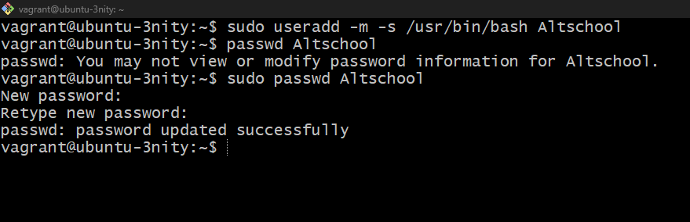
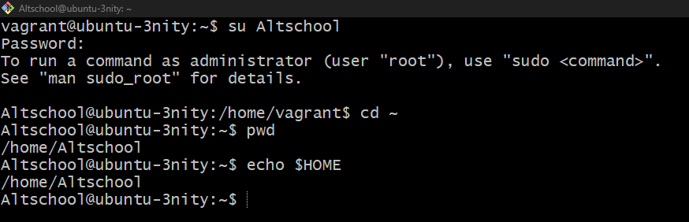
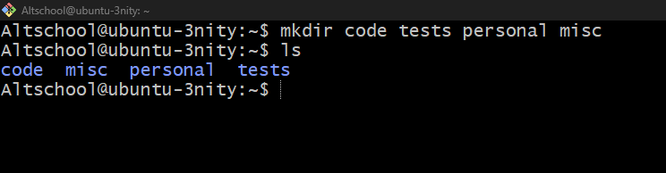

**you are running commands from the home directory.**
```
Altschool@ubuntu-3nity:~$ echo $HOME
Altschool@ubuntu-3nity:~$ ls
```

- Change directory to the tests directory using absolute pathname
```
Altschool@ubuntu-3nity:~$ cd /home/Altschool/tests
```
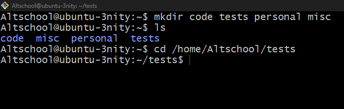

- Change directory to the tests directory using relative pathname
```
Altschool@ubuntu-3nity:~$ cd ..
Altschool@ubuntu-3nity:~$ cd ./tests
```
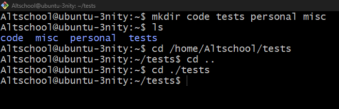

- Use echo command to create a file named fileA with text content ‘Hello A’ in the misc directory
```
Altschool@ubuntu-3nity:~$ ls
Altschool@ubuntu-3nity:~$ echo 'Hello A' > /home/Altschool/misc/fileA
Altschool@ubuntu-3nity:~$ cat 'Hello A' > /home/Altschool/misc/fileA
```
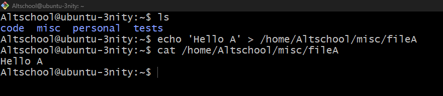

- Create an empty file named fileB in the misc directory. Populate the file with a dummy content afterwards

```
Altschool@ubuntu-3nity:~$ ls
Altschool@ubuntu-3nity:~$ touch /home/Altschool/misc/fileB
Altschool@ubuntu-3nity:~$ ls /home/Altschool/misc/fileB
Altschool@ubuntu-3nity:~$ vim /home/Altschool/misc/fileB
Altschool@ubuntu-3nity:~$ cat /home/Altschool/misc/fileB
```
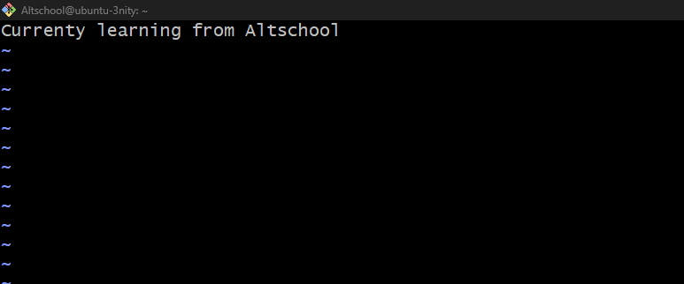

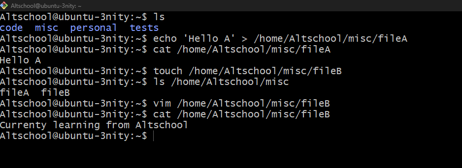

- Copy contents of fileA into fileC
```
Altschool@ubuntu-3nity:~$ cp /home/Altschool/misc/fileA /home/Altschool/misc/fileC
Altschool@ubuntu-3nity:~$ cat /home/Altschool/misc/fileC
Altschool@ubuntu-3nity:~$ cat /home/Altschool/misc/fileA
```
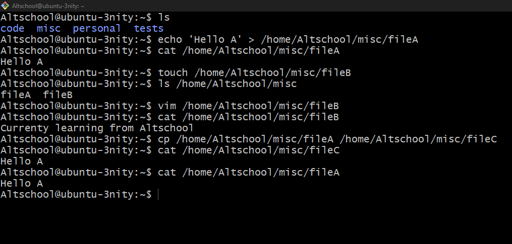

- Move contents of fileB into fileD
```
Altschool@ubuntu-3nity:~$ mv /home/Altschool/misc/fileB /home/Altschool/misc/fileD
Altschool@ubuntu-3nity:~$ ls /home/Altschool/misc/fileC
```
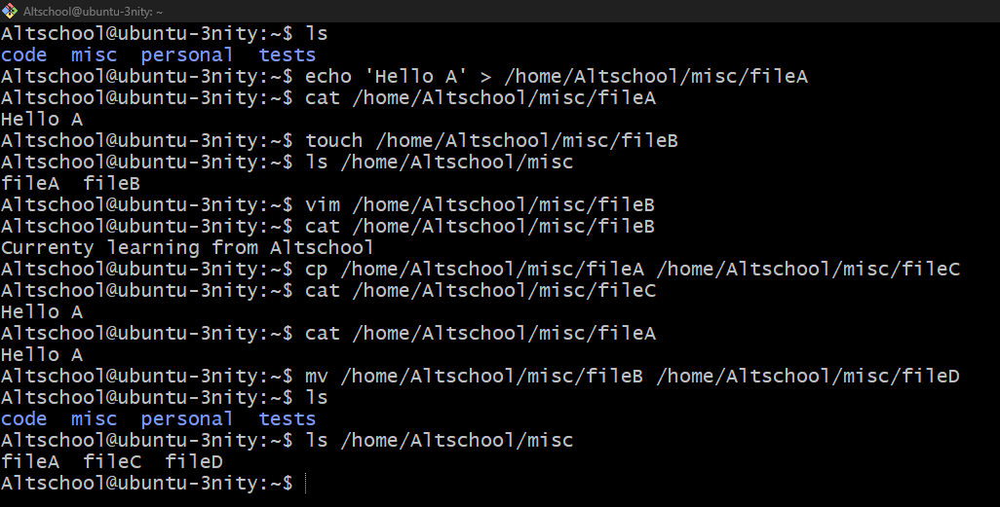

- Create a tar archive called misc.tar for the contents of misc directory
```
Altschool@ubuntu-3nity:~$ ls /home/Altschool/misc
Altschool@ubuntu-3nity:~$ tar -cvf misc.tar misc
Altschool@ubuntu-3nity:~$ ls
```
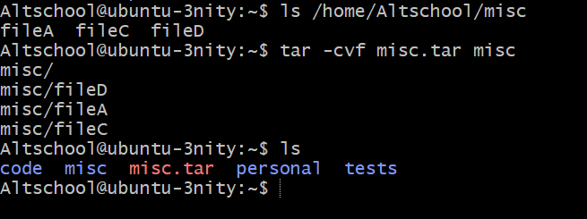

- Compress the tar archive to create a misc.tar.gz file
```
Altschool@ubuntu-3nity:~$ gzip misc.tar
Altschool@ubuntu-3nity:~$ ls
```
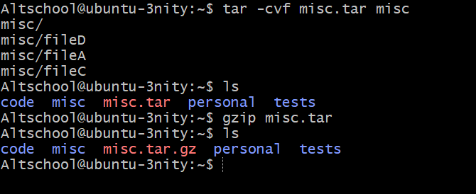

- Create a user and force the user to change his/her password upon login
```
Altschool@ubuntu-3nity:~$ sudo useradd Kenneth
Altschool@ubuntu-3nity:~$ sudo passwd Kenneth
Altschool@ubuntu-3nity:~$ sudo chage -d 0 Kenneth
Altschool@ubuntu-3nity:~$ su Kenneth
```


- Lock a users password
```
Altschool@ubuntu-3nity:~$ sudo passwd -l Kenneth
Altschool@ubuntu-3nity:~$ su Kenneth
```
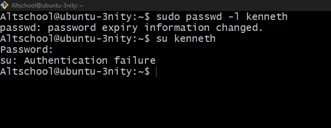

- Create a user with no login shell
```
Altschool@ubuntu-3nity:~$ sudo useradd -s/usr/sbin/nologin seyi
```
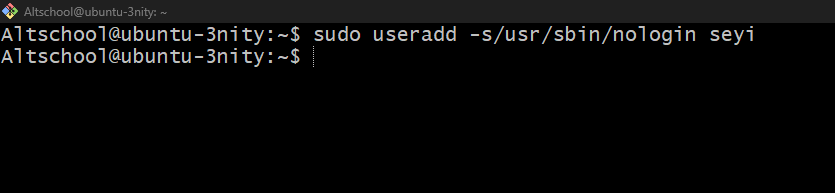
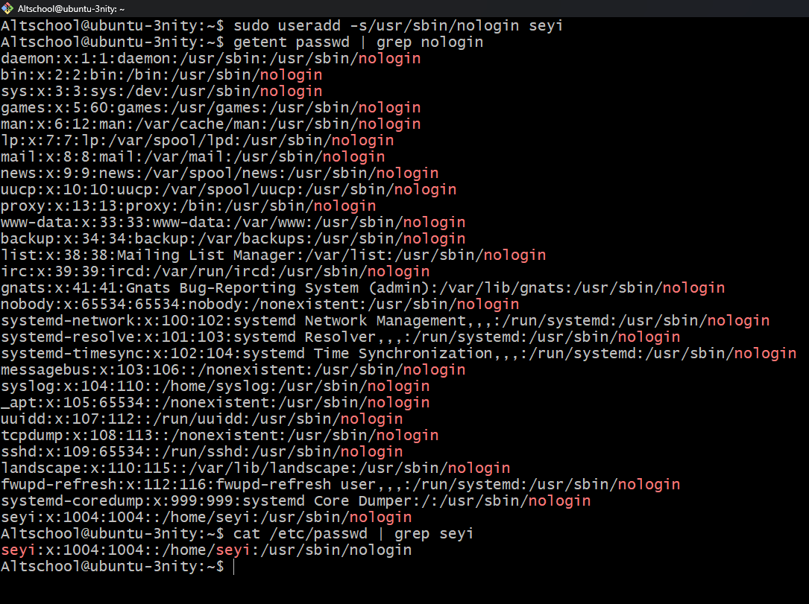

- Disable password based authentication for ssh
```
Altschool@ubuntu-3nity:~$ cd /etc/ssh
Altschool@ubuntu-3nity:~$ cp /etc/ssh/sshd_config /etc/ssh/sshd_config2
Altschool@ubuntu-3nity:~$ vim /etc/ssh/sshd_config
```
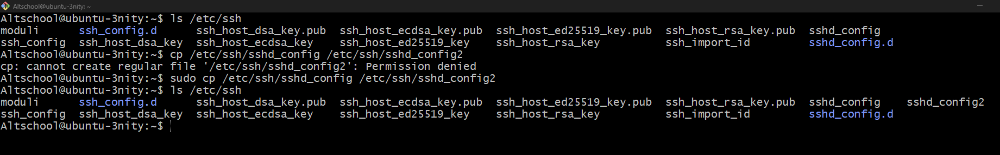
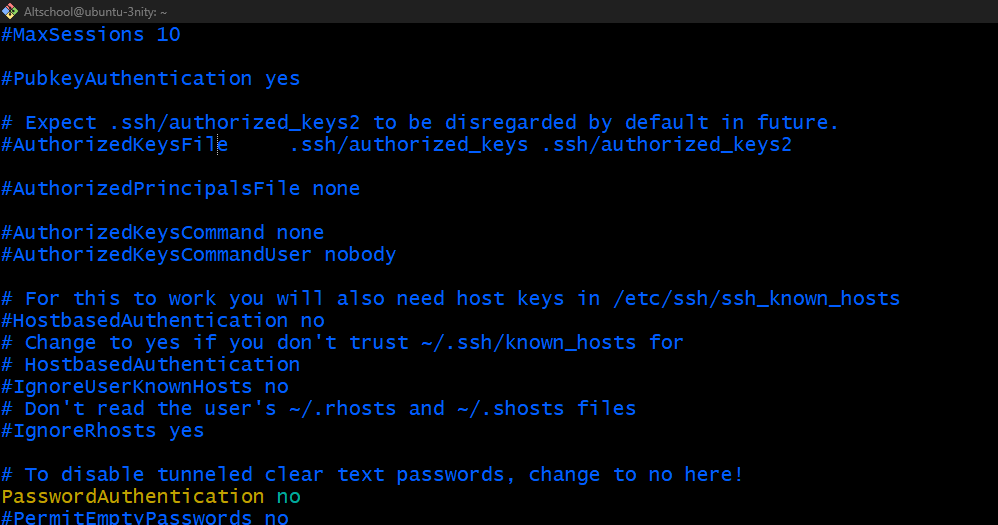

- Disable root login for ssh
```
Altschool@ubuntu-3nity:~$ cd /etc/ssh
Altschool@ubuntu-3nity:~$ cp /etc/ssh/sshd_config /etc/ssh/sshd_config2
Altschool@ubuntu-3nity:~$ vim /etc/ssh/sshd_config
```
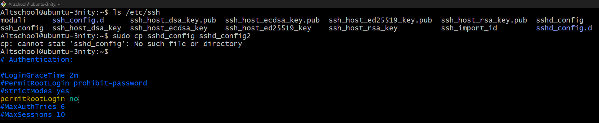

